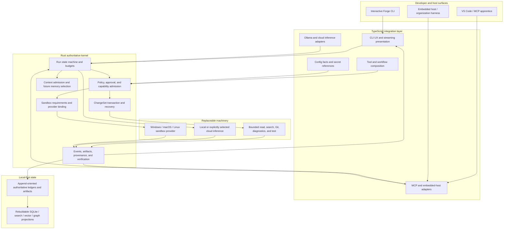
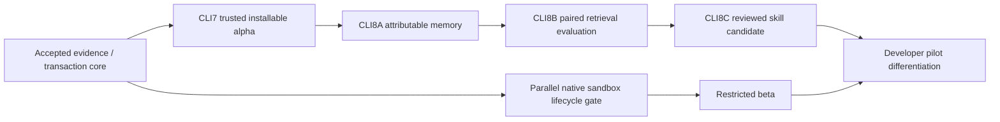

# ForgeEngine V1 system map and build strategy

**Status:** explanatory map; contracts and ADRs remain authoritative
**Date:** 2026-08-17

ForgeEngine is one evidence-producing runtime with several surfaces. TypeScript owns
fast-changing product integration; Rust owns decisions and durable execution truth.
Replaceable databases, model providers, and OS sandbox providers sit behind those
contracts rather than becoming alternate runtimes.

The arrows matter: adapters can provide facts and perform approved work, but only
the kernel can admit a capability, declare a transaction state, or produce the
authoritative run artifact. A graph or vector database accelerates a query; it does
not decide truth.

## Delivery strategy

The sandbox lane and learning lane share contracts but not release claims. The
trusted alpha does not claim containment; the restricted beta cannot ship until an
exact OS/provider gate passes. Memory and skills cannot bypass policy or mutation
authority.

## Recommended public extension boundary

For alpha, expose only versioned, narrow contracts:

- MCP tools/resources for out-of-process host integration;
- an embedded TypeScript host adapter over the same Rust run protocol;
- provider adapters that normalize inference facts but cannot route implicitly;
- declarative, reviewed skills that request existing capabilities;
- read-only event/artifact readers with documented schema windows.

Do not stabilize Rust module layouts, database tables, arbitrary in-process plugin
hooks, raw shell/write tools, or internal projection schemas. This keeps third-party
integration possible without freezing implementation internals or creating parallel
runtimes. A post-alpha ADR must decide which of these surfaces receives a public
compatibility promise.
