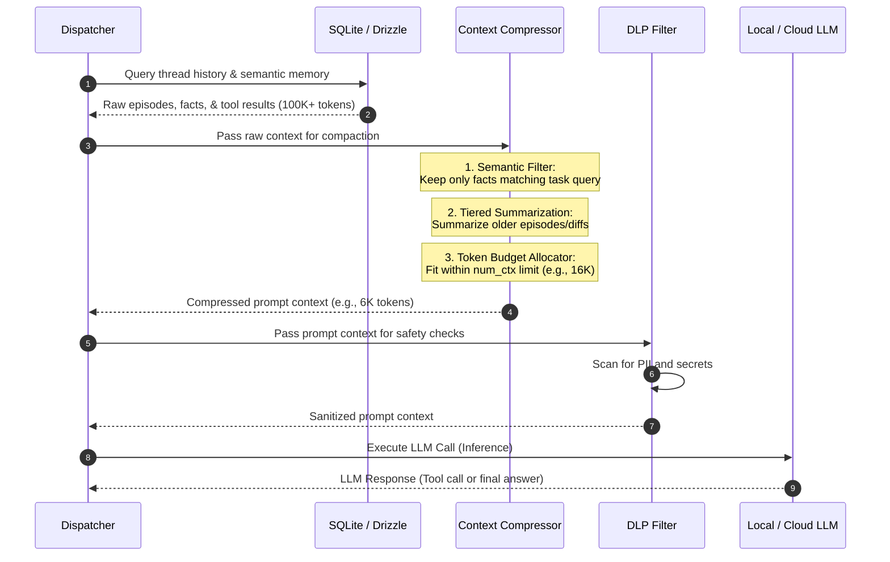

# Forge-Harness: Context Compression & Retrieval Pipeline Architecture

This document describes the design, flow, and architecture of the context compression and adaptive retrieval pipeline for **Forge-Harness**. This system is specifically engineered to enable lower-bound local models (e.g., 8K–32K context windows) to perform complex, multi-turn reasoning as efficiently as cloud models, while optimizing cloud token budgets when external providers are utilized.

---

## 1. Core Architectural Goals

- **Sovereign Efficiency**: Minimize dependencies on massive context windows by treating context space as high-value, low-latency RAM.
- **Precision Ingestion**: Deliver only the highest-signal tokens to the LLM at each step.
- **Dynamic Summarization**: Progressively condense historical context into hierarchical metadata.
- **Decoupled Egress Filtering**: Ensure all retrieved items are passed through the DLP and Egress validation gates before entering the model's prompt.

---

## 2. Memory Tiering & Retrieval Pipeline

Forge utilizes a two-tier memory system (In-Memory active state + SQLite durable state) to implement a three-part cognitive memory taxonomy:

```mermaid
graph TD
    User([User Request / Task]) --> Executor[Workflow Executor]
    
    subgraph Active Context Window (Working Memory)
        PromptContext[Synthesized Prompt Context]
        SystemInstructions[Procedural Memory: Role Prompt]
        ActiveState[Current Node/Tool State]
    end
    
    subgraph Durable Storage (SQLite + Drizzle)
        Episodic[Episodic Memory: task logs, run history, checkpoints]
        Semantic[Semantic Memory: facts, preferences, code patterns]
    end
    
    Executor --> |Query Semantic Db| Semantic
    Executor --> |Load Active Node Checkpoint| Episodic
    
    Semantic --> |Retrieve Relevant Facts| PromptContext
    Episodic --> |Selectively Promote Historical Results| PromptContext
    ActiveState --> PromptContext
    SystemInstructions --> PromptContext
    
    PromptContext --> |DLP Scan & Redaction| LLM[LLM Inference]
```

---

## 3. The Compression & Retrieval Pipeline Flow

When an agent is dispatched, the context is assembled and compressed using a pipeline of summarizers, retrievers, and validators:



---

## 4. Pipeline Components

### 4.1. Semantic Cache & Fact DB (`memoryStore`)
- Stores key-value assertions about the repository, environment, and user preferences (e.g., `pkg_manager: pnpm`, `lint_rules: strict`).
- Each memory has a `confidence` rating (0-100) and `validFrom`/`validUntil` temporal metadata.
- **Adaptive Retrieval**: Forge queries the local semantic cache using keyword and category overlap. Only matching metadata is promoted to the context window.

### 4.2. Tiered Episodic Summarization
- Forge retains complete run details (tool outputs, compiler logs) in SQLite.
- For active LLM prompts, the last 2 episodes are kept in full (Hot state).
- Episodes 3–10 are summarized into a concise markdown change-list (Warm state).
- Episodes beyond 10 are completely compressed into a single-sentence status summary (Cold state).

### 4.3. Progressive Tool Disclosure
- Instead of exposing all tools to the agent, the harness only exposes the tools relevant to the agent's active `role`.
- This reduces the model's system prompt overhead (the JSON Schema descriptions of tools) by up to **70%**, freeing up critical context space.

### 4.4. Memory Consolidation Daemon
- A post-run async process runs when a workflow finishes or is suspended.
- It scans the raw episodic logs (`agentResults`) and extracts candidate facts.
- **Example**: If an agent failed to build because of a missing dependency, ran `npm install x`, and then successfully built, the consolidation daemon writes a semantic memory: `Dependency 'x' is required for building.`
- Outdated facts are invalidated via **Cascade Invalidation** to prevent context pollution.

---

## 5. Token Budget Allocation Map

When compiling context for a 16K token limit local model, Forge uses the following allocation policy:

| Context Component | Max Budget | Type of Compaction |
|-------------------|------------|--------------------|
| **System Prompt & Role** | 1,500 tokens | Static / compressed instructions |
| **Active Task / Input** | 2,000 tokens | Raw |
| **Tool Declarations** | 1,500 tokens | Progressive disclosure (role-specific only) |
| **Semantic Memories** | 2,000 tokens | Ranked by relevance + confidence |
| **Episodic History** | 6,000 tokens | Tiered summarization (Hot/Warm/Cold) |
| **Safety Buffers** | 3,000 tokens | Preserved for model output |

---

## 6. Sovereignty and Token Savings

By using this architecture, Forge accomplishes two tasks:
1. **Model Equality**: Enables local models with 16K–32K limits to work on large codebases by replacing raw file dumps with dynamic, semantic pointer retrieval.
2. **Cost Containment**: When using cloud providers, the pipeline reduces token usage on repeated turns by **50–80%** compared to naive "dump entire thread history" architectures.
