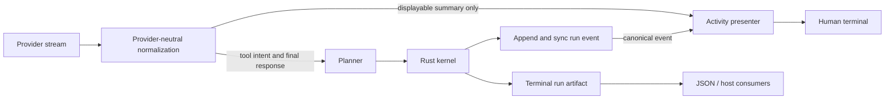

# ADR-0040: Authority-labeled terminal activity stream

**Date:** 2026-09-09
**Status:** Proposed for Architecture Gate review; Product Gate approved; no
runtime implementation authorized
**Scope:** Human-mode `forge run`, `forge interactive`, and accepted run-resume
presentation
**Extends:** ADR-0018, ADR-0021, ADR-0029, ADR-0036, and ADR-0037
**Supersedes:** none

## Context

Forge already streams validated assistant text in human mode and renders selected
canonical Rust `RunEvent` status after the event has been appended to the durable
run ledger. Machine `--json` mode emits one terminal artifact. This is trustworthy
but not yet a polished implementing-developer experience: the user sees sparse
status lines, does not see provider-supplied reasoning summaries, and receives
little useful narration around evidence, tools, approvals, and verification.

The accepted Product outcome is a terminal-only alpha experience that feels like
sitting beside an implementing developer who explains what they are doing while
they work. The output must remain honest about the difference between:

- a durable Rust-authoritative event;
- a provider-reported, user-displayable reasoning summary or trace;
- a deterministic sentence derived by the presentation layer; and
- private or encrypted model reasoning that Forge must not expose or claim to
  possess.

Calling every line "reasoning" would make untrusted provider prose look like
runtime truth. Sending provider tool arguments or raw capability output directly
to the terminal would also bypass the accepted policy, redaction, append-before-
notify, and bounded-evidence paths. The stream therefore needs an explicit
authority model rather than a more verbose `console.log` implementation.

The terminal Product Gate predates the separate CLI8B/C architecture proposal and
this lane is scheduled to integrate first. It therefore takes the next available
repository-wide number, ADR-0040. The unmerged CLI8B/C proposal must be renumbered
to ADR-0041 before integration; neither proposal is accepted merely by reserving a
number.

## Decision drivers

- Make alpha runs understandable without requiring ledger or JSON inspection.
- Preserve one Rust authority for lifecycle, approval, capability, and outcome
  truth.
- Support useful provider narration without claiming access to provider-private
  chain of thought.
- Keep JSON, pipes, MCP, and embedded hosts stable.
- Keep terminal output bounded, secret-safe, cancellation-safe, and cross-platform.
- Give later terminal or graphical frontends one testable presentation contract.
- Avoid extra inference calls merely to narrate activity.

## Options considered

### Option A: Print every provider event and tool payload

This is superficially transparent but leaks implementation-private reasoning,
arguments, prompt material, or secrets; it also presents pre-policy provider intent
as if it were an accepted action. Rejected.

### Option B: Show only durable Rust run events

This preserves authority but cannot provide the human working narration requested
for the alpha and cannot use an explicit provider reasoning-summary channel.
Rejected as the complete product experience, retained as the authoritative spine.

### Option C: Ask the model for additional narration calls

This increases cost and latency, can change model behavior, and gives providers
without a summary channel a misleading imitation of hidden reasoning. Rejected for
the first lane.

### Option D: Merge authority-labeled canonical and provisional activity

The terminal presenter consumes durable run events plus a narrowly normalized,
user-displayable provider reasoning channel. It labels their authority, never uses
presentation output as runtime input, and preserves one terminal artifact in JSON
mode. Accepted for review.

## Decision

### 1. Separate activity into three authority classes

Every rendered activity item has one of these sources:

- `canonical_run`: a Rust `RunEvent` already synchronized through the accepted
  append-before-notify run bridge;
- `provider_reported`: a provider-native, explicitly user-displayable reasoning
  summary or trace delta, provisional until the associated inference completion
  is recorded;
- `presentation_derived`: a deterministic label or grouping derived solely from
  already available canonical or provider-reported input.

The process-local display order is not a durable event sequence. Where an item
comes from a canonical run event, it carries the durable `runId` and `sequence`.
Provider narration carries `requestId`, provider, and model. Nothing in the
presentation contract can approve a capability, establish evidence, alter a run,
or become memory.

### 2. Do not expose or promise raw chain of thought

Forge may render only:

- a provider field documented as a user-displayable reasoning summary;
- ordinary assistant response text; and
- deterministic Forge activity descriptions.

Forge must not render encrypted reasoning, private scratch state, hidden prompts,
provider continuation tokens, or provider fields whose disclosure contract is
unknown. Ordinary assistant text must not be relabeled as hidden reasoning.
Providers without a supported summary channel receive deterministic Forge activity
only; Forge does not synthesize fake internal thoughts.

### 3. Preserve output-channel contracts

- Final assistant response text remains on stdout in human mode.
- Activity, lifecycle, approvals, warnings, and evidence summaries remain on
  stderr so stdout can still be consumed independently.
- `--json` disables human activity and continues to emit exactly one terminal JSON
  artifact; this ADR adds no NDJSON mode.
- Interactive prompts remain owned by the TTY-aware adapter accepted after
  ADR-0021. One presenter arbitrates open narration and response lines so status
  output cannot corrupt editing or cursor state.
- MCP and embedded hosts do not inherit terminal formatting. A later host may reuse
  typed activity inputs, not ANSI or rendered strings.

### 4. Use one tight presentation preference

The effective configuration adds selection field `display.activity` with values:

- `auto` (built-in default): detailed on a human TTY, compact for non-TTY human
  output, and off for `--json`;
- `detailed`: provider summaries plus canonical evidence/action/result narration;
- `compact`: canonical phase changes and required decisions only;
- `off`: final response plus required approvals, warnings, and errors only.

The CLI override is `--activity <auto|detailed|compact|off>` and the environment
form is `FORGE_ACTIVITY`. The optional configuration path is `display.activity`.
This is a presentation selection, never a policy ceiling. Workspace configuration
may select it because it grants no authority, but command-line and other accepted
selection precedence still applies. `forge config show` reports the effective
source. `--json` is an output contract and therefore forces human activity off
without mutating configuration.

### 5. Normalize only explicit displayable reasoning events

`NormalizedInferenceEvent` gains `displayable_reasoning.delta` with `format` equal
to `summary` or `trace`. Each adapter may emit it only from a provider field whose
public contract explicitly permits user display:

- OpenAI Responses detailed mode requests `reasoning: { summary: "auto" }` and
  maps only `response.reasoning_summary_text.delta` to `format: "summary"`.
  `response.reasoning_text.delta`, `reasoning.encrypted_content`, and unknown
  reasoning items never map to terminal activity. Summary text is removed from
  any provider-private continuation item before that item is replayed so changing
  display mode does not add terminal narration to later model context.
- Ollama detailed mode maps `message.thinking` to `format: "trace"`, matching
  Ollama's documented display contract. Forge does not set or change the request's
  `think` value in this lane; it displays a trace only when the configured model
  and Ollama route already emit one.

Unknown provider frames remain ignored under the existing adapter contract;
recognized malformed display frames remain actionable provider errors. Encrypted
or opaque reasoning items may be retained only where already required for same-
provider continuation and are never mapped to this event.

Availability is a provider capability, not a Forge quality or trust claim. The
terminal must remain coherent when no displayable reasoning arrives. If OpenAI
rejects only the optional `reasoning.summary` parameter before emitting any
response event, Forge may retry the same provider, endpoint, model, task input,
tools, and request identity exactly once without that field and emit one bounded
warning. It must not retry after any provider event or for an ambiguous failure.

### 6. Reveal accepted tool activity, not raw intent

Provider `tool_call.delta` arguments are never rendered. The first user-visible
tool action comes from canonical `capability.requested`, after Rust validation and
durable append. `capability.completed`, approval, outcome, budget, failure, and
cancellation use their canonical events.

Detailed mode may show a bounded allowlisted preview derived from a validated
`CapabilityResult`; it must not dump arbitrary raw JSON or unbounded stdout/stderr.
Byte-for-byte live subprocess output would require a new Rust bridge/run-event
contract and is excluded from the first authorized packet. The first packet shows
command/capability start, completion, and a bounded accepted result summary.

### 7. Bound and sanitize presentation

- Cumulative provider summary/trace text is limited to 65,536 Unicode scalar
  values per inference request.
- One rendered activity line is limited to 1,024 characters after control-character
  removal and whitespace normalization.
- One detailed capability-result preview is limited to 4,096 UTF-8 bytes.
- NUL, terminal escape, and non-printing control characters are removed from
  provider and capability-derived activity before rendering.
- Raw provider tool arguments, credentials, effective secret values, full prompts,
  and full context items are never activity inputs.
- Truncation is explicit once per source and does not fail or change the run.

These controls reduce accidental disclosure; they are not a general DLP or
prompt-injection-resistance claim.

### 8. Presentation cannot affect execution authority

Activity mode has one narrow provider-request effect: detailed mode may request
an OpenAI display summary as defined above. It cannot change provider, endpoint,
model, reasoning effort, prompt/context, tools, storage, capability decisions,
event order, memory, or outcome assessment. Ollama thinking is observed but never
enabled or tuned by this setting. Rendering failure, coalescing, color, and terminal
width have no provider-request effect. Required approvals and errors cannot be
suppressed by `off`.

Given the same non-display provider outputs, every activity mode must produce an
equivalent canonical artifact. OpenAI summary generation can add latency and
billable output, so `compact`, `off`, non-TTY `auto`, and `--json` do not request it.

### 9. Defer persisted activity and live process chunks

Provider summaries are live, bounded presentation observations in this lane. They
are not added to `RunEvent`, `RunArtifact`, memory, or a new activity ledger.
Durable replay continues to reconstruct canonical status from the run ledger and
the terminal assistant response from the artifact. Persisted provider narration,
machine-streaming NDJSON, byte-level process output, and graphical UI rendering
require later gates.

## Consequences

### Positive

- The default TTY experience becomes materially more legible and human.
- Canonical actions remain visibly distinct from provisional model narration.
- Providers can expose useful summary channels without becoming authorities.
- JSON and host integrations remain stable.
- Future frontends can test typed inputs rather than scrape terminal strings.

### Negative

- Providers without native summary support cannot match the richest narration.
- Live provider summaries are not replayable in the first lane.
- The configuration addition touches a shared alpha contract and its complete
  conformance suite.
- Live subprocess bytes remain deferred, so long-running commands initially expose
  start/completion rather than a full terminal mirror.

### Risks and mitigations

- **Narration is mistaken for truth:** label it as `working`, retain canonical
  event labels, and never feed it into policy or evidence.
- **Terminal output becomes noisy:** use `auto`, `compact`, and `off`; keep phase
  labels stable and avoid repeating unchanged state.
- **Provider summary leaks sensitive content:** accept only explicit summary fields,
  sanitize controls, bound output, and retain the no-general-DLP non-claim.
- **TTY editing regresses:** one renderer owns line transitions; repeat the real
  Windows VS Code Backspace, help, and exit gate.
- **Parallel lanes conflict:** freeze contracts first and serialize `src/cli.ts`,
  configuration, help, shared fixtures, workflows, and operational docs.

## Validation plan

- Golden transcripts cover `auto`, `detailed`, `compact`, `off`, JSON, TTY, and
  non-TTY behavior.
- Provider fixtures cover OpenAI summary present, absent, fragmented, rejected-
  before-stream, oversized, control-character, reasoning-text, encrypted-only,
  tool-call, failure, and cancellation cases; Ollama fixtures separately cover
  displayable `message.thinking` present/absent without changing `think`.
- Artifact equivalence proves activity mode cannot change canonical output.
- Tool arguments and unapproved capability result content never appear in activity.
- Open narration is closed before canonical status, approval, error, cancellation,
  and assistant output lines.
- The complete configuration compiler/source/projection/service tests pass for the
  optional `display.activity` field.
- Exact product gates pass on Windows x64, macOS ARM64/x64, and Ubuntu x64.
- A real Windows VS Code integrated-terminal pilot verifies readable narration,
  Backspace editing, cancellation, required prompts, and `/exit`.

## Revisit conditions

Reopen this ADR before:

- persisting provider narration or treating it as memory/evidence;
- emitting machine-readable incremental activity;
- exposing raw or encrypted reasoning;
- adding live subprocess stdout/stderr to the Rust run protocol;
- letting presentation configuration suppress approvals/errors; or
- adding a graphical renderer that changes the typed activity contract.

## References

- [OpenAI reasoning summaries](https://developers.openai.com/api/docs/guides/reasoning#reasoning-summaries)
- [OpenAI Responses streaming event reference](https://developers.openai.com/api/reference/cli/resources/beta/subresources/responses)
- [Ollama thinking capability](https://docs.ollama.com/capabilities/thinking)
