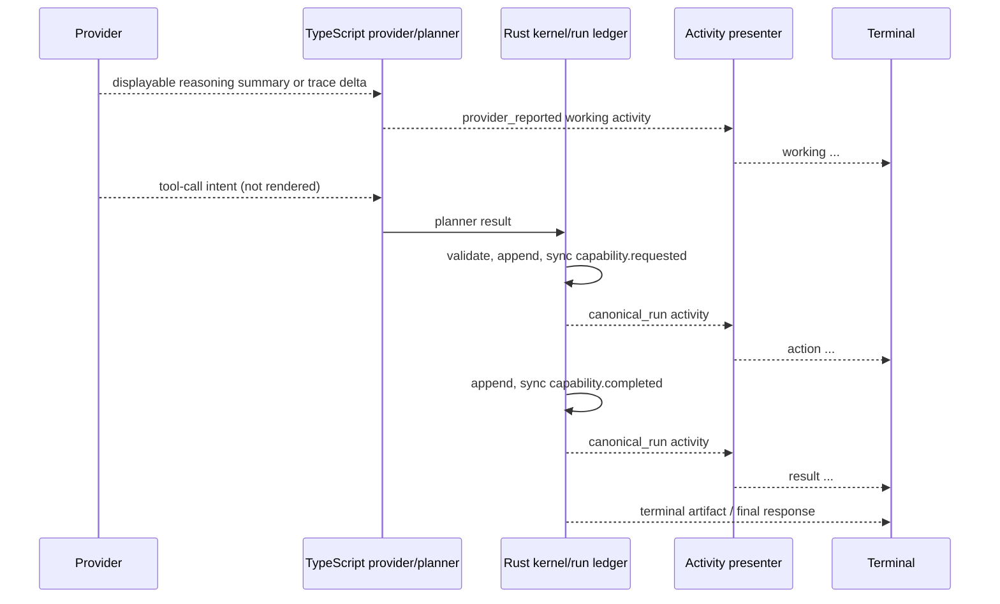
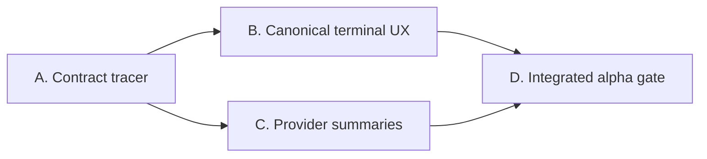

# CLI observable activity: four-gate review packet

**Delivery path:** full
**State:** Product approved; Architecture ready for review; Program Design and
Vertical Slices drafted; implementation inactive
**Build-plan authority:**
[ForgeEngine V1 validated build plan](../architecture/forgeengine-v1-validated-build-plan.md)
**Related ADRs:**
[ADR-0018](../decisions/ADRs/ADR-0018-provider-neutral-inference-and-debt-retirement.md),
[ADR-0021](../decisions/ADRs/ADR-0021-ephemeral-interactive-shell.md),
[ADR-0029](../decisions/ADRs/ADR-0029-append-before-notify-run-ledger.md),
[ADR-0036](../decisions/ADRs/ADR-0036-alpha-distribution-and-configuration-contract.md),
and [ADR-0037](../decisions/ADRs/ADR-0037-protocol-compatibility-and-migration.md)
**Proposed ADR:**
[ADR-0040](../decisions/ADRs/ADR-0040-authority-labeled-terminal-activity-stream.md)
**Canonical lane:** `CLI-OBSERVABLE-ACTIVITY`
**Common base:** PR #35 merge `7a1dc12`
**Integration owner:** main Forge continuation task after Gate 3 approval

This packet reconstructs the terminal observable-activity lane recorded as Product-
approved on 2026-09-02. It turns the requested Codex-like implementing-developer
narration into explicit authority, configuration, output, and test contracts. It
does not expose hidden chain of thought or authorize implementation.

## Approval ledger

| Gate | Status | Revision/material | Approver | Date | Decision source |
| --- | --- | --- | --- | --- | --- |
| Product | approved | Gate 1 below | Maintainer | 2026-09-02 | Main Forge discussion; recorded in the architecture changelog with CLI8A Slice 5 authorization. |
| Architecture | ready for review | ADR-0040 and Gate 2 below | | | Requires explicit approval. |
| Program Design | draft | Gate 3 below | | | Review only after Architecture approval. |
| Vertical Slices | draft | Packages A-D below | | | No package is authorized. |

## Gate 1: Product

### User and problem

The primary user is an individual developer running Forge in a local repository.
Today the terminal proves canonical status but feels sparse: the developer cannot
easily follow what the model is trying to accomplish, which evidence Forge is
using, when an action becomes authorized, or why the run changes direction.

The desired alpha experience feels like sitting beside an implementing developer
who rubber-ducks the work out loud. It should be transparent enough to test and
debug from the terminal without requiring JSON, ledger inspection, or a graphical
frontend.

### Desired journey

1. The developer starts an ordinary `forge run` or interactive prompt without
   configuring a logging subsystem.
2. Forge briefly states the current working intent when the provider exposes a
   supported user-displayable summary or trace.
3. Forge identifies evidence selection and accepted capability lifecycle in plain
   language.
4. Tool intent becomes an action only after the canonical Rust request event.
5. Approvals, verification, cancellation, and failures interrupt the narration
   clearly.
6. The final answer remains visually distinct from activity.
7. A developer who wants less output uses one discoverable `activity` preference;
   JSON users continue receiving one machine artifact.

### Interaction sketch

```text
$ forge run "Fix the parser regression"

working   I’ll locate the parser boundary and reproduce the failing case first.
context   6 items selected; 2 omitted; 18 KiB of 64 KiB
evidence  searching the current repository
action    workspace.search requested
result    workspace.search completed
working   The failing branch is isolated; I’m checking its existing tests.
action    workspace.read requested
result    workspace.read completed
verify    accepted outcome met

assistant> The parser regression is fixed and the focused tests pass.
```

`working` means provider-reported user-displayable summary, not raw hidden thought.
`action`, `result`, `context`, and `verify` are derived from canonical run events.

### Observable success and acceptance examples

- A first-time user can tell what Forge is doing, what actually ran, and whether it
  was verified without opening an artifact.
- Provider narration never makes an unapproved tool call look executed.
- OpenAI summary data and Ollama trace data are shown only when the adapter can
  identify the explicit provider field; neither being present still yields a
  coherent run.
- `--json` output is byte-for-byte free of human activity lines.
- `auto`, `detailed`, `compact`, and `off` resolve predictably and `config show`
  identifies their source.
- Given the same non-display provider outputs, every activity mode has an
  equivalent canonical artifact.
- Real Windows VS Code typing, Backspace, cancellation, prompts, and exit remain
  usable while activity streams.

### Smallest end-to-end demonstration

Run one deterministic two-turn fixture and one real local-provider task:

1. provider displayable reasoning arrives in fragments;
2. the model proposes one read-only tool;
3. Rust appends and emits capability request/completion events;
4. a second summary explains the observed evidence;
5. the assistant answer and evidence summary complete;
6. the fixture is repeated in all activity modes and JSON;
7. the real VS Code terminal confirms readable ordering and editing.

### Non-goals and non-claims

- no raw, hidden, encrypted, or private chain-of-thought exposure;
- no claim that narrated reasoning is true, complete, or authoritative;
- no extra inference calls solely to generate narration;
- no graphical/TUI frontend in this lane;
- no machine-readable incremental NDJSON stream;
- no persistence of provider narration as run truth, memory, or evidence;
- no raw provider tool arguments or unrestricted capability payload dumps;
- no byte-for-byte live subprocess terminal mirror in the first packet;
- no new capability, approval, sandbox, provider, memory, or retrieval authority;
- no general secret-scanner, DLP, or prompt-injection-resistance claim.

### Open product decisions

None required before Architecture review. The first packet intentionally treats
"terminal activity" as accepted start/completion/result summaries. Byte-level live
subprocess output is a later product and protocol decision.

## Gate 2: Architecture

### Fit with the accepted system

- ADR-0018 remains the provider-neutral inference boundary.
- ADR-0021 remains the interactive terminal ownership boundary.
- ADR-0029 remains the append-before-notify source for canonical run activity.
- ADR-0036 remains the only effective-configuration compiler and provenance view.
- ADR-0037 governs any later persisted or bridge schema change.
- PR #35 merge `7a1dc12` remains the common implementation base and this lane does
  not activate CLI8B retrieval.

### End-to-end flow and ownership



Rust owns run truth, sequence, approvals, capability lifecycle, outcome, and
artifacts. TypeScript owns provider normalization, presentation-mode resolution,
terminal line arbitration, and human wording. Provider narration remains
provisional and cannot enter Rust policy or evidence through the activity path.

### Data, state, identity, and authority contracts

- `NormalizedInferenceEvent.displayable_reasoning.delta` is an internal provider-
  neutral display signal with `summary|trace` format, not a persisted run event.
- `TerminalActivityEnvelope` classifies `canonical_run`, `provider_reported`, and
  `presentation_derived` sources.
- Canonical envelopes retain `runId` and `sequence`; provider envelopes retain
  request/provider/model identity; display `ordinal` is process-local only.
- Effective config adds optional `display.activity` selection with built-in `auto`.
- The presenter consumes typed values and produces text; rendered text is never
  parsed back into runtime state.

### Failure, recovery, compatibility, and migration

- Existing configuration files remain valid because `display.activity` is optional.
- Unknown activity config values fail through the existing actionable config error
  path.
- JSON, MCP, service, and embedded execution artifacts do not change.
- Missing provider reasoning-display support silently falls back to canonical
  narration.
- Detailed OpenAI mode requests `reasoning.summary: auto`; an explicit pre-stream
  rejection of only that optional field permits one same-route retry without it
  and one warning. An ambiguous or post-event failure never retries.
- Oversized summary input is explicitly truncated for display without failing the
  inference or changing the artifact.
- Cancellation closes any open activity line before rendering the canonical
  cancellation result.
- Run inspection/replay reconstructs canonical activity only; it does not claim to
  replay provisional provider narration.

### Security, privacy, provenance, and platform boundary

- Provider summary/trace text is untrusted display content and is sanitized before
  terminal output.
- Provider tool arguments, encrypted reasoning, full prompts, and raw context are
  excluded from activity.
- Capability display begins only after Rust validation and append.
- Activity settings cannot weaken approval, policy, route, sandbox, or memory
  behavior.
- ANSI/control-sequence injection and unbounded output receive direct negative
  fixtures.
- This remains trusted terminal presentation, not OS isolation or general DLP.

### Alternatives and least-confident decisions

ADR-0040 rejects raw provider dumping, canonical-only sparse output, and additional
narration calls. The least-confident boundary is provider-summary portability:
providers expose different fields and some expose none. The replacement condition
is a stable provider-neutral standard or evidence that deterministic Forge
narration gives a better user experience at lower disclosure risk.

The second uncertainty is live subprocess output. It remains excluded until a
separate design proves bounded append-before-notify semantics and secret handling
without turning display into a second execution protocol.

### ADR changes and retained non-claims

ADR-0040 is proposed. It changes no accepted runtime schema and retains every Gate
1 non-claim.

## Gate 3: Program Design

**Status:** draft. The contract below becomes freeze material only after ADR-0040
is explicitly approved.

### Proposed file-tree diff

```text
src/
  activity/
    contracts.ts              # exclusive: typed display inputs and modes
    presenter.ts              # exclusive: line-safe human renderer
    sanitize.ts               # exclusive: bounds and terminal-safe text
  config/
    contracts.ts              # shared: display.activity definition
    sources.ts                # shared: file/env/CLI collection
    schema.ts                 # shared: optional display.activity validation
    resolve.ts                # shared: selection precedence
    projection.ts             # shared: effective diagnostics
  inference/
    contracts.ts              # shared: displayable_reasoning.delta
    stream.ts                 # shared: bounded observation forwarding
    openai.ts                 # exclusive provider mapping
    ollama.ts                 # exclusive provider mapping
  cli.ts                      # serial integration: flag/config/presenter wiring
  live-cli.ts                 # serial migration shim, then removal or re-export
tests/
  activity-contracts.test.ts
  activity-presenter.test.ts
  fixtures/activity/*.json
  inference.test.ts
  configuration-*.test.ts
  live-cli.test.ts
  interactive-cli.test.ts
  cli.test.ts
docs/
  decisions/ADRs/ADR-0040-*.md
  tasks/CLI-OBSERVABLE-ACTIVITY-FOUR-GATE-REVIEW.md
  execution/current.md
  architecture/forgeengine-v1-validated-build-plan.md
```

No Rust file, bridge protocol, `RunEvent`, `RunArtifact`, run ledger, MCP schema,
or memory schema changes in Packages A-D.

### Types, interfaces, signatures, and schemas

```ts
export type ConfiguredActivityMode = 'auto' | 'detailed' | 'compact' | 'off';
export type ResolvedActivityMode = Exclude<ConfiguredActivityMode, 'auto'>;

export type ActivityAuthority =
  | 'canonical_run'
  | 'provider_reported'
  | 'presentation_derived';

export type ActivityKind =
  | 'working'
  | 'run'
  | 'context'
  | 'evidence'
  | 'action'
  | 'result'
  | 'approval'
  | 'verify'
  | 'warning';

export interface TerminalActivityEnvelope {
  readonly schemaVersion: 1;
  readonly ordinal: number; // process-local presentation order only
  readonly authority: ActivityAuthority;
  readonly kind: ActivityKind;
  readonly message: string;
  readonly runId?: string;
  readonly runSequence?: number;
  readonly requestId?: string;
  readonly provider?: string;
  readonly model?: string;
  readonly reasoningFormat?: 'summary' | 'trace';
  readonly truncated?: true;
}

export type NormalizedInferenceEvent =
  | {
      readonly type: 'displayable_reasoning.delta';
      readonly format: 'summary' | 'trace';
      readonly text: string;
    }
  | ExistingNormalizedInferenceEvent;

export interface ActivityPresenter {
  onInferenceEvent(observation: ProviderInferenceObservation): void;
  onRunEvent(event: RunEvent): void;
  printAssistantOutput(output: string): void;
  printSummary(artifact: RunArtifact): void;
  close(): void;
}

export function resolveActivityMode(input: {
  readonly configured: ConfiguredActivityMode;
  readonly json: boolean;
  readonly stdinTty: boolean;
  readonly stdoutTty: boolean;
  readonly stderrTty: boolean;
}): ResolvedActivityMode;
```

`display.activity` is a `selection` field normalized by
`activity_mode_v1`; eligible sources are managed, command line, environment,
workspace, user, and built-in. Its CLI option is `--activity`, environment key is
`FORGE_ACTIVITY`, config path is `display.activity`, and built-in value is `auto`.
It is non-sensitive and appears in the existing source-attributed diagnostics.

The resolved mode may be supplied to provider construction as display intent.
OpenAI detailed mode adds only `reasoning: { summary: 'auto' }`; compact/off/JSON
omit it. The adapter maps only `response.reasoning_summary_text.delta`, strips
summary text from provider-private continuation replay, and never maps
`response.reasoning_text.delta` or encrypted content. Ollama never receives a
different `think` value from this feature; detailed mode maps an already emitted
`message.thinking` field as `trace`. This is the only accepted request-level effect
of activity mode.

### Principal call stacks and state transitions

```text
CLI parse -> compile effective configuration -> resolveActivityMode
  -> create ActivityPresenter
  -> ProviderTaskPlanner.onInferenceEvent
       -> supported provider reasoning -> provider_reported envelope -> stderr
  -> RustKernelRuntime.onEvent
       -> append-before-notify RunEvent -> canonical_run envelope -> stderr
  -> terminal artifact
       -> assistant stdout + evidence summary stderr
```

Presenter line state is:

```text
idle -> working_open -> working_delta*
working_open -> canonical_interrupt -> idle
working_open -> response_completed -> idle
idle -> assistant_open -> assistant_delta*
assistant_open -> canonical_interrupt -> idle
any -> cancellation/error/close -> idle
```

Closing an open line is idempotent. Required approvals and errors render in every
human mode. Detailed and compact are views over the same canonical inputs.

### Errors, limits, cancellation, and determinism

- Invalid `--activity` or config values use `config_value_invalid` or the existing
  CLI-argument error path with the four allowed values and a corrective hint.
- Provider summary deltas are bounded to 65,536 scalar values per request; one
  truncation warning is emitted and later summary deltas are ignored for display.
- Sanitized activity lines are at most 1,024 characters; capability previews are
  at most 4,096 UTF-8 bytes.
- Control characters other than normalized newline/tab input are removed before
  line rendering; ANSI escape is never passed through.
- Mode resolution is pure and fixed by effective config plus output/TTY facts.
- Same typed inputs, resolved mode, terminal-width class, and fixed timestamps
  produce the same text. No timer-based spinner is part of the contract.
- An OpenAI rejection may be retried only when no stream event has arrived and the
  structured provider error identifies `reasoning.summary` as the unsupported
  field. The retry preserves route, model, input, tools, and request identity.
- Presentation failures cannot fabricate canonical success. A closed output pipe
  follows the existing cancellation/exit path; formatting fallback emits one
  bounded warning and continues with canonical compact output.

### Fixtures, tests, and exact validation commands

Frozen fixtures:

- fragmented OpenAI summary followed by one tool call and completion;
- explicit OpenAI pre-stream summary rejection and same-route retry;
- OpenAI reasoning-text/encrypted items that must never render;
- Ollama `message.thinking` present/absent with request-body equivalence;
- oversized/control-character summary;
- denied approval, capability failure, cancellation, budget exhaustion, and unmet
  verification;
- assistant delta interrupted by a canonical event;
- equivalent artifact across all display modes;
- valid/invalid config at every source and source-attributed `config show` output.

Focused commands:

```text
npx tsx --test tests/activity-contracts.test.ts tests/activity-presenter.test.ts
npx tsx --test tests/live-cli.test.ts tests/inference.test.ts tests/interactive-cli.test.ts
npx tsx --test tests/configuration-contracts.test.ts tests/configuration-sources.test.ts
npx tsx --test tests/configuration-resolve.test.ts tests/configuration-compile.test.ts
npx tsx --test tests/configuration-projection.test.ts tests/configuration-service.test.ts
npx tsx --test tests/configuration-cli.test.ts tests/cli.test.ts
npm run check:product
npm run rust:audit
npm run release:smoke
npm run package:native:pack
npm run benchmark:hybrid
```

Hosted acceptance repeats the declared Windows x64, macOS ARM64/x64, Ubuntu x64,
and RustSec jobs. A separate real Windows VS Code terminal pilot checks detailed
narration, Backspace, `/help`, cancellation, required approval, and `/exit`.

### Shared boundaries, exclusive ownership, and integration plan

- Package A owns only `src/activity/contracts.ts`, frozen activity fixtures, and
  this packet/ADR.
- Package B owns `src/activity/presenter.ts`, `sanitize.ts`, presentation tests, and
  the configuration files/tests. `src/cli.ts` is integrated serially.
- Package C owns provider mapping in `openai.ts`, `ollama.ts`, `stream.ts`, and
  inference tests after Package A freezes the event contract.
- Package D is the sole integration owner for `src/cli.ts`, `live-cli.ts`, help,
  interactive wiring, smoke/package fixtures, workflows, and operational docs.
- CLI8B/C may continue documentation work separately. It may not modify the shared
  CLI/config/inference files until Package D merges or the integration owner
  explicitly reopens ownership.

### Unresolved decisions

None may be inferred by implementation owners. Reviewers must explicitly accept:

- the authority labels and non-persistence of provider narration;
- the `auto|detailed|compact|off` modes and TTY defaults;
- the optional `display.activity` effective-config field;
- the narrow detailed-mode OpenAI summary request, pre-stream retry rule, and
  summary-free continuation replay;
- the Ollama observe-only rule that never changes `think`;
- summary and preview limits;
- completion-only capability output in this packet; and
- Package D as serial integration owner.

## Gate 4: Vertical Slices



| Package | Observable proof | Depends on | Owned files | Shared files | Acceptance evidence | Merge/re-steer point |
| --- | --- | --- | --- | --- | --- | --- |
| A. Contract tracer | Frozen typed activity inputs and one golden terminal transcript agree on authority labels. | Product + Architecture + Program Design approval | `src/activity/contracts.ts`, activity fixtures/tests | ADR/task docs | Contract tests and `git diff --check` | Stop if provider narration cannot remain outside run truth. |
| B. Canonical terminal UX | Default TTY shows clear context/action/result/approval/verification narration with compact/off controls. | A | presenter, sanitizer, presentation/config tests | config modules; later `src/cli.ts` integration | Focused presenter/config tests; artifact equivalence | Stop if display mode changes execution or JSON. |
| C. Provider reasoning display | OpenAI summary and already-emitted Ollama trace fragments render as `working`; private/encrypted reasoning never renders. | A | provider adapters and inference tests | inference contracts/stream | Provider fixtures for mapping, absence, malformed input, bounds, pre-stream retry, continuation isolation, and cancellation | Stop if an adapter cannot distinguish a documented display field from private reasoning or if display changes continuation context. |
| D. Integrated alpha gate | `forge run`, interactive, and safe resume provide one coherent cross-platform stream and pass real VS Code. | B + C | CLI integration, help, product fixtures, acceptance docs | `src/cli.ts`, `src/live-cli.ts`, workflows, current/build plan | Full product/RustSec/package/benchmark/hosted/VS Code gates | Re-steer rather than adding raw process streaming or changing Rust schemas. |

### Authorized slice packet

None. Product is approved; ADR-0040 Architecture, Gate 3 contracts, and Packages
A-D require explicit approval before implementation.

### Parallelization map

After Package A merges its frozen contracts, Packages B and C may run in parallel
because presenter/configuration ownership and provider-adapter ownership are
exclusive. Package D is serial and rebases both onto the exact accepted common
base. Shared CLI, help, workflows, and operational docs have one integration owner.

## Checkpoint and acceptance record

- Exact candidate: documentation proposal only on the branch containing this file
- Commands and results: pending documentation validation
- Hosted evidence: not applicable; no runtime implementation
- Accepted boundary: Product Gate only
- Retained non-claims: all Gate 1 exclusions above
- Next gate: explicit Architecture approval of ADR-0040
