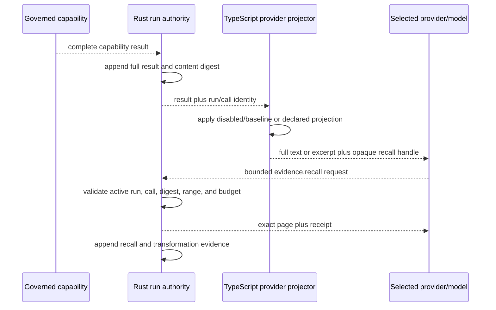
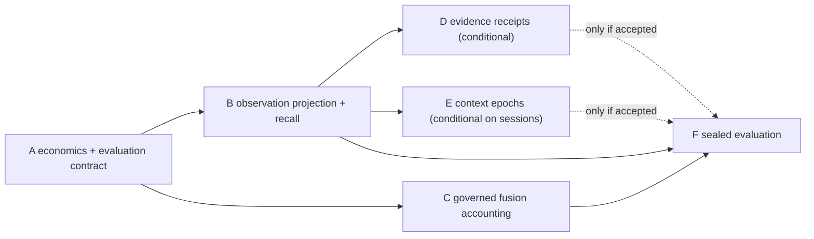

# CLI9 harness efficiency and context economics: four-gate review draft

**Delivery path:** full
**State:** research-informed discovery draft; no gate approved; no implementation
authorized
**Build-plan authority:**
[ForgeEngine V1 validated build plan](../architecture/forgeengine-v1-validated-build-plan.md)
**Related accepted boundaries:**
[ADR-0018](../decisions/ADRs/ADR-0018-provider-neutral-inference-and-debt-retirement.md),
[ADR-0025](../decisions/ADRs/ADR-0025-rust-owned-capability-context-and-lifecycle.md),
[ADR-0029](../decisions/ADRs/ADR-0029-append-before-notify-run-ledger.md),
[ADR-0036](../decisions/ADRs/ADR-0036-alpha-distribution-and-configuration-contract.md),
and [Slice CLI8](SLICE-CLI8-differentiated-learning-loop.md)
**Canonical lane:** `CLI9-HARNESS-EFFICIENCY`
**Integration owner:** unassigned until Gate 3 approval

This packet converts the useful findings from NVIDIA's SoL-Pi work into bounded
Forge implementation hypotheses. It does not copy SoL-Pi's extension architecture,
authorize a generic edit/shell shortcut, activate automatic compaction, or claim
parity with Codex, Pi, Claude Code, Sol, or Opus harnesses.

The active terminal observable-activity lane and the separately gated CLI8B/C work
retain their current order. CLI9 may not begin implementation until the current
terminal gate is settled, CLI8B Product/Architecture has frozen the shared
evaluation contract, and this packet passes all four gates.

## Approval ledger

| Gate | Status | Revision/material | Approver | Date | Decision source |
| --- | --- | --- | --- | --- | --- |
| Product | draft | Gate 1 below | | | SoL-Pi research follow-up requested 2026-09-21. |
| Architecture | draft | Gate 2 below | | | Research translation only; no ADR accepted. |
| Program Design | draft | Gate 3 below | | | File and schema names are proposed, not frozen. |
| Vertical Slices | not started | Gate 4 below | | | Every package remains inactive. |

## Research finding and Forge disposition

The paper reports two distinct results that must not be conflated:

- its complete efficiency configuration reduced recorded token traffic by 49.0%
  on GPT-5.6 Sol and 44.7% on Opus 5, and reported API cost by about one third
  relative to Pi;
- the corresponding held-out EdgeBench score was lower than Pi by about 6.3% on
  Sol and 5.7% on Opus. On a separate 63-task CPU-only Terminal-Bench subset,
  SoL-Pi solved 15 tasks while Pi and Codex each solved 18.

That is a promising cost/quality trade, not evidence that the full stack is a
strict capability improvement or that it matches every native harness. Forge will
therefore adopt the paper's constrained-search method and test its mechanisms as
separate hypotheses. A lower token count cannot pass an acceptance gate by itself.

| SoL-Pi mechanism | Forge disposition | Reason |
| --- | --- | --- |
| ObservationPack | **Adapt first.** Keep the full canonical result in Forge's Rust-owned run record; project only the provider-visible copy and expose exact bounded recall through a governed read capability. | It directly addresses repeated large tool results and fits Forge's existing artifact/context model without weakening action authority. |
| Action Fusion | **Measure the existing Forge equivalent.** `workspace.change.execute` already composes proposal, review, isolated verification, and promotion under one governed capability. | A new edit-plus-shell tool would bypass Forge's transaction and verification design. The research question is whether the existing composition saves turns without reducing accepted outcomes. |
| Evidence-Preserving Reducer | **Conditional and off by default.** Prefer deterministic diagnostic parsers. Consider a reducer only after exact-quote verification, route/privacy controls, and original-result fallback exist. | Nested model calls create extra cost and an egress boundary. Quote preservation is useful but is not sufficient proof that omitted evidence was irrelevant. |
| Online Context Compact | **Defer until persistent sessions.** Require semantic plan boundaries, actual cut-point accounting, provider cache/cost telemetry, resumable continuation, and a priced summarization call. | The current CLI has bounded run checkpoints, not the cross-prompt session model needed to make automatic compaction safe or economically honest. |
| Recursive auto-research loop | **Use offline for candidate selection, never as production self-modification.** Search only declared configurations on development tasks, then freeze code/config before one-way acceptance and sealed holdout evaluation. | This gains the paper's experimental discipline without allowing evaluation feedback to mutate the shipping harness or its authority boundaries. |

The public SoL-Pi repository makes every mechanism opt-in and retains original
observations for recall. It also exposes useful hazards for Forge's design: remote
reducers can leak sensitive logs, filesystem archive/symlink behavior is
platform-sensitive, repeated-observation counters must be scoped correctly, and a
compaction estimate can be wrong when it ignores the runtime's actual message cut
point. These are inputs to Forge's threat model, not defects to reproduce.

## Gate 1: Product

### User and problem

Long tool-driven runs repeatedly resend prior observations, pay for context that no
longer changes the next decision, and sometimes spend an extra model turn on work
that Forge already knows how to compose. Forge records input/output usage but does
not yet attribute cache traffic, auxiliary model work, context transformations, or
quality-adjusted cost. It therefore cannot honestly tell whether a seemingly
cheaper harness is more efficient or has merely done less useful work.

The primary user is a developer who wants Forge to approach the quality/cost
frontier of leading Sol- and Opus-based coding harnesses while retaining Forge's
stronger evidence, approval, mutation, and sovereign-execution boundaries.

### Desired journey

1. A developer runs a representative, verifier-backed task with every experimental
   mechanism disabled and receives a reproducible baseline report.
2. Forge records provider usage and cost components, capability/turn counts,
   retries, corrections, wall time, context transformations, recalls, and the
   accepted outcome.
3. A large prior tool result remains complete in the authoritative run record, but
   later provider requests receive a bounded projection with an opaque recall
   handle rather than another full replay.
4. The model can request an exact line-bounded page. Forge verifies the handle,
   run binding, content hash, and bounds before returning the original bytes.
5. The same task is evaluated with one mechanism changed at a time and, only after
   individual acceptance, with a composed candidate.
6. Forge promotes no default based on tokens alone. The candidate must meet a
   predeclared quality floor and improve cost, turns, or latency on paired tasks.
7. A report identifies the model, harness, configuration digest, task snapshot,
   verifier, price manifest, mechanism activations, failures, and confidence
   interval so a “near native harness” claim is inspectable.

### Observable success and acceptance examples

- A repeated 80 KiB read remains byte-for-byte available in the run artifact, while
  the provider-visible replay is a deterministic excerpt plus a stable handle.
- An exact recall of lines 400–499 returns only those lines, their source digest,
  and declared bounds; a forged, stale, cross-run, out-of-range, or symlink-backed
  request fails closed.
- Projection disabled produces the current provider transcript. Projection enabled
  changes no canonical capability result, approval, verification, or final artifact.
- A candidate that saves 40% of tokens but crosses the quality non-inferiority
  margin, increases false-pass rate, or adds corrective turns fails.
- A candidate with equal accepted outcomes and a statistically credible reduction
  in cost per accepted outcome may advance to a separately approved default-on
  decision.
- Sol and Opus reports are separate. Opus comparison remains unavailable rather
  than simulated until an Anthropic route passes the ordinary Slice 7 provider
  conformance gate.

### Smallest end-to-end demonstration

Use a deterministic two-turn fixture with a large bounded tool observation:

1. run the unchanged full-replay baseline;
2. run the provider-projection candidate against the same snapshot and scripted
   inference;
3. prove identical canonical results and outcome state;
4. prove the candidate's second provider request is smaller;
5. recall one omitted page and verify it against the original content digest;
6. reject forged, stale, cross-run, oversized, and invalid-range recalls;
7. emit a paired evaluation record with quality, tokens, cost status, turns,
   transformation, recall, latency, and integrity fields.

The first live pilot then uses one explicitly selected Sol route and a small set of
predeclared Forge fixtures. It makes no cross-harness parity claim.

### Non-goals and non-claims

- no generic shell, unrestricted write, or model-authored verification command;
- no replacement for `workspace.change.execute` or the Rust transaction authority;
- no lossy mutation of the canonical `CapabilityResult` or run ledger;
- no automatic memory retrieval, skill activation, or widening of CLI8 scope;
- no automatic context compaction in the first authorized packet;
- no model-based log reduction or remote log egress in the first packet;
- no hidden online harness mutation, auto-merge, or tuning on held-out results;
- no claim that equal token counts mean equal work across providers;
- no Anthropic/Opus route smuggled into this lane;
- no claim of exact SoL-Pi reproduction: the public release does not include every
  auto-research trajectory, search corpus, or evaluation configuration needed for
  that claim.

### Open product decisions

- Select and freeze the development, one-way acceptance, and sealed holdout task
  manifests before Gate 3 approval.
- Set a verifier-score non-inferiority margin and minimum cost/turn improvement.
  The margin must be task-level and cannot be chosen after results are visible.
- Decide whether the first external comparison is Forge-versus-native Codex on one
  exact Sol model or Forge-versus-Pi. Do not combine unlike models into one ranking.

## Gate 2: Architecture

### Fit with the accepted system

- Rust remains the authority for run identity, complete capability results,
  artifact identity, recall admission, event ordering, budgets, and accepted
  outcomes.
- TypeScript remains responsible for provider normalization, constructing the
  provider-only representation, collecting provider-specific usage facts, and
  orchestrating the offline evaluation runner.
- A provider projection is a reversible representation of evidence, not a new
  source of truth. Its receipt points back to the canonical run/call/content digest.
- Existing config compilation remains the only activation path. Every mechanism is
  off by default, source-attributed, and unknown values fail closed.
- Shared run/protocol/schema changes require a new ADR and ADR-0037-compatible
  migration before implementation.

### End-to-end flow and ownership



The projector may reduce only the provider-visible copy. It may not alter
`capability.completed`, the terminal artifact, verification input, approval facts,
or recovery state. Recall is a narrow high-level read capability over already
admitted evidence, not arbitrary filesystem access.

### Data, state, identity, and authority contracts

Proposed concepts, subject to Gate 3 and an ADR:

```text
ObservationIdentityV1
  runId, callId, contentSha256, utf8Bytes, lineCount

ProviderObservationProjectionV1
  strategy, identity, exposureOrdinal, completeRanges,
  omittedUtf8Bytes, projectedUtf8Bytes, recallHandle

EvidenceRecallRequestV1
  handle, startLine, lineCount

EvidenceRecallReceiptV1
  identity, requestedRange, returnedRange, returnedSha256,
  complete, utf8Bytes

HarnessEvaluationRecordV1
  taskManifestDigest, snapshotId, harnessRevision, modelRoute,
  effort, mechanismConfigDigest, priceManifestDigest, outcome,
  usage, cost, turns, capabilities, retries, correctiveTurns,
  wallTime, transformations, recalls, integrityFindings
```

Handles must be opaque, tamper-evident, scoped to their active run, and bound to the
canonical `runId`, `callId`, and content digest. Their secrecy is not an authority
boundary, and they never contain a local path.
Paging uses normalized UTF-8 line boundaries and declared maximum bytes/lines. A
consumer can determine whether a page begins or ends mid-observation and whether
more exact evidence exists.

Threshold, excerpt shape, and exposure count are evaluated configuration, not
architecture constants. SoL-Pi's “over 10 KiB” and “send full twice” behavior are
candidate treatments, not Forge defaults.

Usage and cost evidence must distinguish at least input, cache-read, cache-write,
output, reasoning when reported, auxiliary-model usage, and unavailable fields.
Reported and price-manifest-estimated cost remain visibly different. Evaluation
must price the reducer or compaction summary call as well as the main model.

### Failure, recovery, compatibility, and migration

- Projection failure returns the original result when it still fits the existing
  safe provider limit; it never emits a partial projection presented as complete.
- If a result exceeds the provider limit and no valid projection can be produced,
  the run fails with an actionable bounded-evidence error.
- Missing or partial provider usage remains `unavailable`; it is never coerced to
  zero. Cost comparisons exclude or separately report incomplete records.
- Recall rejects a missing run, unrecognized handle, hash mismatch, stale/expired
  record, invalid UTF-8 boundary, excessive page, or exhausted budget.
- Recovery reconstructs handle validity from authoritative run state, not a
  TypeScript-only map. Restart behavior must be explicit before live enablement.
- Existing configurations and artifacts remain valid. Schema changes use versioned
  fixtures and copy-on-write migration; no in-place historical rewrite.

### Security, privacy, provenance, and platform boundary

- Recall reads only the canonical observation already associated with the active
  run. It cannot accept a path, URL, glob, command, or alternate content digest.
- Artifact/object access rejects symlinks, junction escapes, non-regular files, and
  replacement races on every Tier-1 platform. Do not rely on Unix-only
  `O_NOFOLLOW` behavior as the sole Windows defense.
- Retention, privacy purge, and run deletion apply to full observations and any
  derived projection/receipt indexes together. A projection must not become a
  forgotten shadow copy.
- A future remote reducer requires an explicit cloud route, locality evidence,
  likely-secret rejection as defense in depth, a no-egress mode, and user-visible
  provenance. Secret detection is not a confidentiality boundary.
- Repository text cannot enable a mechanism, choose a reducer route, change a
  threshold, or waive a benchmark gate.

### Alternatives and least-confident decisions

- **Deterministic head/tail versus structural excerpts:** start with deterministic
  complete-line excerpts. Add parser-aware excerpts only when language-specific
  fixtures prove better evidence recall.
- **Run ledger versus separate content-addressed object:** prefer the existing run
  store for the first fixture. Split large content into a Rust-owned CAS only if
  measured artifact size/replay needs justify it; either representation retains
  one canonical digest and lifecycle.
- **One recall capability versus per-tool paging:** one read-only evidence recall
  contract is easier to evaluate, but Gate 3 must prove it cannot become arbitrary
  artifact browsing.
- **Model reducer:** confidence is low that a nested model beats deterministic
  compiler/test parsers after its own cost and privacy boundary are counted.
- **Online compaction:** confidence is low until Forge can calculate the runtime's
  actual removable prefix and demonstrate safe continuation across cancellation,
  crash, and a summary failure.

### ADR changes and retained non-claims

Before Package B, propose an ADR for provider-only evidence projection, exact
recall identity/lifecycle, and the run/protocol schema change. Before Packages D or
E, reopen Architecture with separate decisions for remote reduction or session
compaction. This draft accepts none of them.

## Gate 3: Program Design

### Proposed file-tree diff

Names remain illustrative until Gate 3 is approved:

```text
docs/tasks/CLI9-HARNESS-EFFICIENCY-FOUR-GATE-REVIEW.md
docs/decisions/ADRs/ADR-00xx-provider-observation-projection-and-recall.md
crates/forge-core/src/evidence_projection.rs
crates/forge-core/tests/evidence_projection.rs
crates/forge-core/tests/fixtures/cli9/*.json
crates/forge-kernel/src/evidence_recall_bridge.rs
src/inference/economics.ts
src/inference/observation-projection.ts
src/inference/contracts.ts
src/inference/planner.ts
scripts/evaluate-harness.mts
tests/observation-projection.test.ts
tests/harness-evaluation.test.ts
tests/hybrid/evidence-recall.hybrid.ts
```

Do not extend `scripts/benchmark-hybrid.mts` into the task benchmark: it measures
Rust bridge latency and should remain a focused regression gate. The new evaluator
consumes sealed task manifests and emits a separate versioned report.

### Principal contracts and transitions

1. `InferenceUsage` gains optional cache-read, cache-write, reasoning, and provider-
   reported cost facts without weakening fail-closed execution ceilings.
2. The Rust run/protocol contract gains observation identity and transformation/
   recall receipts only after an ADR and golden migration fixtures.
3. `ProviderTaskPlanner` replaces its direct append of every full capability result
   with an injected, deterministic projector. `disabled` is byte-compatible with
   current behavior.
4. `evidence.recall` resolves only against prior capability results in the current
   Rust-owned run state, enforces a separate recall budget, and appends a canonical
   receipt before returning.
5. The evaluation runner reads an immutable task manifest, launches one declared
   treatment per isolated snapshot, runs the same external verifier, and writes an
   append-only record plus aggregate report.

### Evaluation design

Every comparison must hold model ID, provider route, effort/reasoning setting,
task snapshot, capability set, timeout, verifier, sampling parameters, and price
manifest constant. If a native harness cannot expose an equivalent control, record
the mismatch and downgrade the comparison rather than silently normalizing it.

Run these treatments before any full stack:

1. unchanged baseline;
2. observation projection only;
3. existing governed change composition measured as one capability versus the
   closest safe unfused workflow available in the fixture;
4. deterministic diagnostic receipts only, if later authorized;
5. online compaction only, if later authorized;
6. a composed candidate containing only individually accepted mechanisms.

Report paired task deltas and confidence intervals for verifier score/pass,
provider cost, cost per accepted outcome, input/cache/output/reasoning/auxiliary
usage, turns, capability calls, retries, corrective turns, wall time, recalls,
unsupported claims, false passes, and integrity failures. Select Pareto-
nondominated candidates after enforcing the predeclared quality floor. Do not
collapse score and cost into one opaque leaderboard number.

The corpus has three one-way partitions:

- **development/search:** candidate thresholds and mechanisms may change;
- **acceptance:** a frozen candidate gets one pass/fail decision and failed results
  return the work to development rather than tuning against these tasks;
- **sealed holdout:** code, config, price manifest, and evaluator are frozen before
  access; results support the final claim and may not feed another candidate in the
  same evaluation cycle.

Start with deterministic Forge issue/PR fixtures, then a small external pilot. A
full EdgeBench or Terminal-Bench claim requires a separately budgeted run,
license/access review, frozen harness adapters, and raw report retention.

### Errors, limits, cancellation, and determinism

- The projector is pure for `(config, identity, content, exposureOrdinal,
  rustIssuedHandle)`.
- Handles and receipts are deterministic within a run but cannot authorize another
  run. Exposure counters are scoped to the exact run branch/continuation.
- Recall has independent maximum lines, bytes, calls, and cumulative bytes.
- Cancellation during projection or recall preserves the original canonical result
  and records no successful receipt.
- Evaluation records distinguish timeout, infrastructure failure, provider failure,
  verifier failure, policy denial, budget exhaustion, and ordinary task failure.
- Any integrity failure fails the treatment regardless of its efficiency result.

### Unresolved decisions before Gate 3 approval

- exact task manifests, repetitions, statistical interval, quality margin, and
  efficiency threshold;
- whether planner request schema gains `runId` or recall identity is carried through
  a narrower kernel-generated context envelope;
- provider-specific usage availability and immutable price-manifest format;
- active-run-only versus restart-stable recall in the first vertical slice;
- projection thresholds and whether the first treatment is immediate or repeated-
  exposure only.

## Gate 4: Proposed vertical slices

Every package below is a draft. Package letters express dependency order, not
authorization.

| Package | Observable proof | Depends on | Primary scope | Acceptance evidence | Merge/re-steer point |
| --- | --- | --- | --- | --- | --- |
| A. Economics and paired-evaluation contract | Baseline run emits complete, honest usage/quality/economic records and a sealed manifest digest. | Terminal activity settled; CLI8B evaluation semantics frozen; Gate 1–3 approval. | Usage normalization, price manifest, evaluator/report schema, deterministic fixtures. | Rust/Node/hybrid schema fixtures; missing-usage tests; paired baseline repeatability; no runtime behavior change. | Freeze metrics, partitions, margins, and cost semantics before mechanism work. |
| B. Provider-only observation projection and exact recall | A large result stays canonical while provider replay shrinks and exact pages remain retrievable. | A; projection/recall ADR and migration fixtures. | Rust identity/admission/receipt; TypeScript projector; recall tool; lifecycle and adversarial tests. | Disabled byte parity; digest/range/expiry/cross-run/symlink tests; restart decision proven; lower second-request input with equal scripted outcome. | Reject or retune if recall/integrity or quality floor fails. |
| C. Governed action-composition accounting | Forge measures whether existing `workspace.change.execute` removes turns/cost without weakening verification. | A; accepted change fixtures. May run parallel with B after shared metrics freeze. | Telemetry and ablation fixtures only; no generic shell/edit tool. | Same final diff and verifier; approval/evidence parity; paired turns/cost report. | Preserve current capability if savings are absent; never widen authority to improve the benchmark. |
| D. Evidence-preserving diagnostic receipts | Long logs yield verified deterministic or model-assisted receipts with exact-source fallback. | A and B; separate privacy/route decision; explicit authorization. | Deterministic parsers first; optional reducer, quote/hash verifier, auxiliary usage/cost. | False-quote, omitted-failure, secret, egress, symlink, cancellation, and fallback corpus; quality/cost floor. | Remain off by default unless it beats original logs on accepted outcomes and total cost. |
| E. Semantic context epochs and compaction | A completed plan epoch compacts at a real removable boundary and resumes without lost evidence. | V1 sessions/projections; A; plan-boundary contract; provider cache economics; separate authorization. | Persistent session state, compaction receipt, continuation/recovery. | Actual cut-point accounting; priced summary; cancellation/crash/retry; two consecutive compactions; no lost pending action. | Defer if savings depend on estimates or recovery is ambiguous. |
| F. Frozen candidate and sealed harness evaluation | Individually accepted mechanisms are composed, frozen, and compared against declared native harness baselines. | B and C; D/E only if individually accepted. | Offline auto-research runner, candidate registry, sealed manifests, external adapters. | One-way acceptance plus sealed holdout; paired confidence intervals; raw records; no post-holdout mutation. | Only a separate reviewed decision can enable a winning mechanism by default or support a parity claim. |

### Proposed parallelization map



B and C may run in parallel only after A freezes the common record schema and their
owned files do not overlap. D and E are independent conditional lanes and cannot
delay F; a frozen candidate may omit either or both. Shared Rust contracts,
`src/inference/contracts.ts`, `src/inference/planner.ts`, configuration schema, and
evaluation manifests have one integration owner and merge serially.

### Authorized slice packet

None. The packet records a proposed sequence only. Creating this document does not
authorize Package A, alter effective configuration, activate a mechanism, or change
the active execution index's next three gates.

## Promotion rule

A mechanism or composed candidate can advance only when all of the following are
true:

1. verifier quality meets the predeclared non-inferiority floor;
2. false-pass, unsupported-claim, evidence-recall, and integrity gates do not
   regress;
3. at least one of cost per accepted outcome, turns, or wall time improves by the
   predeclared threshold, with uncertainty reported;
4. no security, privacy, authority, or recovery boundary is weakened;
5. the mechanism remains attributable and reversible, with the original evidence
   available under the declared retention policy;
6. a separate review explicitly changes its default from off to on.

If results are mixed, report the Pareto frontier and keep the mechanism opt-in. Do
not convert a research win into a product default by editing the benchmark weights.

## Research sources and reproducibility note

- [SoL-Pi paper on arXiv](https://arxiv.org/abs/2609.20519)
- [NVIDIA SoL-Pi source and mechanism overview](https://github.com/NVlabs/SoL-Pi)
- [SoL-Pi configuration and opt-in defaults](https://github.com/NVlabs/SoL-Pi/blob/main/docs/configuration.md)
- [SoL-Pi compatibility and compaction behavior](https://github.com/NVlabs/SoL-Pi/blob/main/docs/compatibility.md)
- [SoL-Pi security boundary](https://github.com/NVlabs/SoL-Pi/blob/main/SECURITY.md)
- [DAIR.AI paper index supplied by the maintainer](https://academy.dair.ai/papers/sol-pi-recursively-scaling-auto-research-loops-for-efficient-agent-harness-2609.20519)

Record the exact paper revision, upstream repository commit, task manifests, harness
revisions, provider/model identifiers, and price manifest in any future checkpoint.
The citations above support the research translation; future Forge results must be
backed by Forge's own raw evaluation artifacts.
