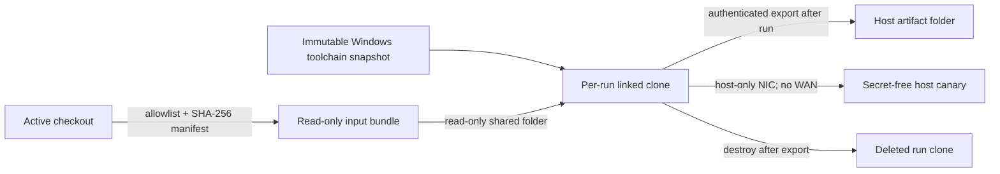

# Forge evaluation lab

**Status:** reproducible scaffold; host setup and the first VM run have not been
performed. The lab is test infrastructure only. It does not promote SRT or change
Forge's provider contract, policy authority, implementation, or readiness claims.

The lab exercises explicitly named **evaluation modules**. In this documentation,
that term means Forge is comparing independently implemented architecture and
patterns—not copying or adopting another project's source. The managed Windows
evaluation module invokes the pinned package through published APIs; the
AppContainer and provider-conformance evaluation modules are original Forge code
against documented Windows/Forge contracts. Lab success cannot erase that label or
promote an evaluation module.

## Decision

Use Oracle VirtualBox's base package as the first local backend, with an immutable
Windows 11 template snapshot and a disposable linked clone for every evaluation.
Do not install the Extension Pack. The selected backend is replaceable: bundle,
guest-runner, evidence, and lifecycle boundaries are intentionally separate from
the `VBoxManage` host driver so a Hyper-V or cloud backend can implement the same
flow later.

VirtualBox is the safest practical local choice for this host because Windows Home
does not provide the Hyper-V/Windows Sandbox management surface, while VirtualBox
supports snapshots and Windows guests on Home once hardware virtualization is
enabled. This is a lab dependency, not a Forge application dependency.



The host repository is never mounted into the guest. SRT's local account, DPAPI
state, WFP filters, ACLs, and any test residue exist only in the disposable clone.

## 2026-08-12 host inventory

The inventory was read-only. The elevated read-only CIM probe and the checked-in
preflight reported:

| Capability | Evidence | Consequence |
|---|---|---|
| OS | CIM: Microsoft Windows 11 Home, 64-bit, build `10.0.26200`; the legacy registry product-name value still says `Windows 10 Home` | Hyper-V and Windows Sandbox cannot be assumed available on this edition. |
| CPU/firmware | Intel Core i9-10900K; 20 logical processors; SLAT and VM-monitor extensions present; `VirtualizationFirmwareEnabled=False` | UEFI/BIOS virtualization must be enabled and the host rebooted before any VM backend can run. |
| Hypervisor | `HypervisorPresent=False`; Hyper-V feature `NotPresent`; no `New-VM`, `New-VHD`, `Checkpoint-VM`, Hyper-V module, `vmms`, or `vmcompute` | No usable Hyper-V backend exists now. |
| Windows Sandbox | `WindowsSandbox.exe` absent; `Containers-DisposableClientVM` feature `NotPresent` | Not a runnable backend on this host. |
| WSL | `wsl.exe` exists, but `wsl --status` says WSL is not installed; WSL and Virtual Machine Platform are `Disabled` | WSL is unavailable and would not exercise the Windows SRT backend anyway. |
| Containers | Docker and Podman commands/services absent | No container backend; a container would not substitute for the required Windows machine boundary. |
| Other VM tools | VirtualBox, QEMU, VMware, Vagrant, and Packer commands absent | A hypervisor must be explicitly installed before use. |
| Host capacity | 15.8 GiB RAM; 133.3 GiB free on `C:` at inventory time | A 4-vCPU/8-GiB disposable guest is feasible but leaves limited host headroom. |
| Build tools | Node `22.19.0`, npm `10.9.3`, Git `2.51.0.windows.1`, Rust/Cargo `1.97.1`; `link.exe` absent | The guest template must include machine-wide MSVC Build Tools; copying the host toolchain is insufficient. |
| Basic tooling | DISM, robocopy, tar, OpenSSH, and winget present | Useful for approved setup, but none was invoked to mutate the host. |

Run the repeatable inventory at any time:

```powershell
powershell.exe -NoLogo -NoProfile -ExecutionPolicy Bypass `
  -File C:\tmp\forge-engine-cli-run-recovery\scripts\lab\Test-ForgeLabHost.ps1 `
  -AsJson
```

The script reports unreadable capabilities as unknown/failed. It never treats an
access denial as readiness.

## Why the other local options were not selected

| Option | Disposition |
|---|---|
| Windows Sandbox | Excellent reset-on-close semantics, but unavailable here, no reusable clean snapshot, and unsuitable for amortizing a patched toolchain image. |
| Hyper-V | Preferred future backend for managed Windows CI, but unavailable on this Home host and firmware virtualization is off. |
| WSL 2 | Disabled and Linux-only; it cannot evaluate SRT's Windows user/WFP/ACL path. |
| Docker/Podman Windows containers | Not installed and not an equivalent boundary for machine-level Windows setup/cleanup behavior. |
| QEMU | Not installed; would add more image, driver, and acceleration work than VirtualBox on this host. |
| VirtualBox base package | Selected: works on Windows Home after VT-x is enabled, exposes snapshots/linked clones and a CLI, and needs no Extension Pack for this design. |

## Files and responsibilities

- `scripts/lab/Test-ForgeLabHost.ps1`: read-only host/backend preflight.
- `scripts/lab/New-ForgeLabBundle.ps1`: copies only build/test sources into an
  immutable run bundle, binds an exact separately packaged evaluation payload, and
  records every file hash plus the dirty checkout state.
- `scripts/stage-managed-provider-evaluation.mjs`: creates that evaluation-only
  payload from exact cached published archives, complete license/NOTICE material,
  and the original Forge published-API adapter. It rejects version/license drift.
- `scripts/lab/Invoke-ForgeVirtualBoxLab.ps1`: creates, starts, invokes, stops, and
  destroys only a run-named linked clone and appends a chained host lifecycle log.
  It never creates host networking or a template.
- `scripts/lab/Start-ForgeLabCanary.ps1`: optional private-address TCP/HTTP canary;
  it logs requests but contains no secret or Internet route.
- `scripts/lab/Test-ForgeLabArtifacts.ps1`: read-only schema-2 finalizer that verifies
  guest artifact hashes, exact provider phases, same-corpus reports, measurements,
  the exact host canary count, both hard reboots, export, shutdown, and clone deletion.
- `scripts/lab/guest/Invoke-ForgeProviderLifecycleGuest.ps1`: verifies the immutable
  bundle/payload, installs Forge and provider dependencies separately/offline, invokes
  only published provider setup/status/uninstall surfaces, runs both Rust-owned exact
  corpus tests, and emits the fail-closed lifecycle gate.
- `scripts/lab/guest/Invoke-ForgeLabGuest.ps1`: retained historical schema-1 runner;
  its TypeScript-only `RunMatrix` evidence cannot satisfy the current gate.
- `scripts/lab/forge-lab.config.example.psd1`: non-secret example configuration.

No script contains a guest password. `VBoxManage guestcontrol` reads one from an
ACL-protected password file outside the checkout, bundle, and artifact directory.
For the first SRT setup, prefer the visible guest console and approve UAC inside the
disposable VM. The guest script refuses to bypass UAC.

## Security posture

The following are invariants, not optional defaults:

1. The template snapshot is immutable. Every run starts as a new linked clone and
   is deleted after artifact export; a used clone is never restored and reused.
2. During evaluation, NIC 1 is host-only and NICs 2-4 are disabled. NAT and bridged
   networking are forbidden. A temporary NAT adapter is allowed only while building
   the clean template, before the snapshot is taken.
3. The host-only canary must be reachable by an unsandboxed guest control request.
   A denial result is invalid if that control fails. The current Rust-owned direct-
   network case independently probes a denied direct loopback connection; it does
   not claim to issue a second canary request. The host log must contain exactly the
   one unsandboxed reachability control.
4. Clipboard and drag-and-drop are disabled. The input share is read-only. There is
   no writable host share during execution; results stay on guest-local NTFS and are
   exported afterward with authenticated Guest Control.
5. The bundle includes allowlisted source/build/test paths, rejects common secret
   filenames and reparse points, and records SHA-256 for every file. It excludes
   `.git`, `node_modules`, `target`, user profiles, `.env`, package credentials, and
   the host workspace outside the staged source.
6. Forge dependencies install with `npm ci --offline --ignore-scripts`. The pinned
   provider and its exact transitive versions install separately from a payload-local
   lock using `npm ci --offline --ignore-scripts`; they never enter the Forge root
   manifest/lock. Missing cache data fails with no network fallback. Cargo commands
   use `--offline`/`--locked`.
7. The guest removes credential- and proxy-shaped environment variables before
   running the harness and records names only, never values.
8. A setup, provider, plan, baseline, canary, evidence, or cleanup failure leaves
   the acceptance gate failed. There is no fallback to trusted execution.

Shared folders require VirtualBox Guest Additions in the template. If Guest
Additions becomes unacceptable for a higher-assurance lane, replace both shares
with a one-shot, hash-verified virtual disk; do not map the checkout directly.

## One-time setup requiring explicit approval

None of these actions was performed by this scaffold task:

1. Enable Intel VT-x in UEFI/BIOS and reboot.
2. Install the VirtualBox base package. This installs host kernel drivers.
3. Create/configure one host-only adapter at `192.168.56.1/24`. This changes host
   networking. If Windows Firewall blocks the canary, any narrow host-only inbound
   rule also needs explicit approval.
4. Obtain a licensed Microsoft Windows 11 ISO or evaluation image. Verify and record
   its SHA-256. Do not commit the image.
5. Create and patch the template VM; install Guest Additions and machine-wide Node
   22, Git, Rust, Cargo, and MSVC Build Tools. Seed npm/Cargo caches while a temporary
   NAT adapter is present. Then remove NAT, scrub setup credentials/logs, shut down,
   and take the `toolchain-clean` snapshot.
6. Inside each disposable run clone, approve SRT `windows-install` via guest UAC.
   It creates `srt-sandbox`, `sandbox-runtime-users`, DPAPI state, and SID-scoped WFP
   filters in that clone. Destroying the clone is the primary cleanup boundary.

Illustrative VirtualBox 7 host commands for the approved one-time setup are below.
Confirm current VirtualBox syntax after installation and substitute the verified ISO
path and disk size. These commands are intentionally not wrapped by the lab runner:

```powershell
VBoxManage.exe hostonlyif create
VBoxManage.exe hostonlyif ipconfig "VirtualBox Host-Only Ethernet Adapter" `
  --ip 192.168.56.1 --netmask 255.255.255.0

VBoxManage.exe createvm --name forge-win11-template --ostype Windows11_64 `
  --basefolder C:\ForgeLab\VirtualBox --register
VBoxManage.exe modifyvm forge-win11-template --firmware efi --cpus 4 `
  --memory 8192 --nic1 nat --nic2 none --nic3 none --nic4 none
VBoxManage.exe createmedium disk --filename C:\ForgeLab\VirtualBox\forge-win11-template.vdi `
  --size 98304 --format VDI
```

Attach the licensed ISO and disk, perform the visible Windows installation, patch
and provision the guest, then remove Internet access and freeze the template:

```powershell
VBoxManage.exe modifyvm forge-win11-template --nic1 none
VBoxManage.exe snapshot forge-win11-template take toolchain-clean `
  --description "Patched Windows; machine-wide toolchain; offline caches; no SRT setup"
```

The snapshot deliberately excludes SRT setup so every run measures installation
cost and tests machine-state cleanup from the same pre-provider baseline.

## Per-run commands

Copy the example config to a private lab directory and adjust only non-secret paths
and names:

```powershell
Copy-Item `
  C:\tmp\forge-engine-cli-run-recovery\scripts\lab\forge-lab.config.example.psd1 `
  C:\ForgeLab\forge-lab.config.psd1
```

First stage the exact evaluation payload from the already inspected published
package tree and cached registry archives. This is a separate evaluation module
input, not an application dependency. It preserves all five exact license texts and
third-party notices, and copies no external implementation source into Forge code:

```powershell
$runId = 'srt-20260812-001'
node.exe C:\tmp\forge-engine-cli-run-recovery\scripts\stage-managed-provider-evaluation.mjs `
  --package-root C:\tmp\forge-srt-provider-0.0.71\node_modules\@anthropic-ai\sandbox-runtime `
  --adapter C:\tmp\forge-engine-cli-run-recovery\scripts\sandbox-provider-srt.mjs `
  --output C:\ForgeLab\Payloads\managed-windows-0.0.71-evaluation-1
```

Create a unique, immutable schema-2 input bundle. This captures every existing
uncommitted allowlisted change without modifying the checkout and rejects any
missing, changed, reparse-point, or unmanifested payload file:

```powershell
powershell.exe -NoProfile -ExecutionPolicy Bypass `
  -File C:\tmp\forge-engine-cli-run-recovery\scripts\lab\New-ForgeLabBundle.ps1 `
  -RepositoryRoot C:\tmp\forge-engine-cli-run-recovery `
  -ProviderPayloadPath C:\ForgeLab\Payloads\managed-windows-0.0.71-evaluation-1 `
  -OutputRoot C:\ForgeLab\Bundles `
  -RunId $runId
```

Start the host-only canary in a separate terminal. Do not approve a broad/public
firewall rule:

```powershell
powershell.exe -NoProfile -ExecutionPolicy Bypass `
  -File C:\tmp\forge-engine-cli-run-recovery\scripts\lab\Start-ForgeLabCanary.ps1 `
  -BindAddress 192.168.56.1 -Port 47831 `
  -LogPath "C:\ForgeLab\Artifacts\$runId\canary.jsonl" -RunId $runId
```

Create and start the linked clone. Keep the first run visible for guest UAC:

```powershell
$lab = 'C:\tmp\forge-engine-cli-run-recovery\scripts\lab\Invoke-ForgeVirtualBoxLab.ps1'
$config = 'C:\ForgeLab\forge-lab.config.psd1'
powershell.exe -NoProfile -ExecutionPolicy Bypass -File $lab `
  -Action Preflight -ConfigPath $config
powershell.exe -NoProfile -ExecutionPolicy Bypass -File $lab `
  -Action Create -ConfigPath $config -RunId $runId `
  -BundlePath "C:\ForgeLab\Bundles\$runId" `
  -ArtifactPath "C:\ForgeLab\Artifacts\$runId" -Confirm
powershell.exe -NoProfile -ExecutionPolicy Bypass -File $lab `
  -Action Start -ConfigPath $config -RunId $runId `
  -ArtifactPath "C:\ForgeLab\Artifacts\$runId" -Confirm
```

Pass `-ArtifactPath "C:\ForgeLab\Artifacts\$runId"` to `Start` and every later host
action so omission of host lifecycle evidence fails closed. First initialize and
verify the guest-local copies without elevation:

```powershell
powershell.exe -NoProfile -ExecutionPolicy Bypass -File $lab `
  -Action InvokeGuest -ConfigPath $config -RunId $runId `
  -GuestMode VerifyPayload -ArtifactPath "C:\ForgeLab\Artifacts\$runId" `
  -GuestPasswordFile C:\ForgeLab\Secrets\guest-password.txt -Confirm
```

Then, in an elevated PowerShell window inside the visible disposable guest, approve
the explicitly authorized guest-only machine mutation and run the package's
published setup command through the lifecycle driver:

```powershell
$guest = 'C:\ForgeLab\Runs\srt-20260812-001\repo\scripts\lab\guest\Invoke-ForgeProviderLifecycleGuest.ps1'
powershell.exe -NoProfile -ExecutionPolicy Bypass -File $guest `
  -Mode InstallEvaluationProvider -RunId srt-20260812-001 `
  -InputRoot \\VBOXSVR\forge-input -OutputRoot C:\ForgeLab\Artifacts `
  -GuestRunRoot C:\ForgeLab\Runs -NpmCache C:\ForgeLab\Caches\npm `
  -CanaryUri http://192.168.56.1:47831/forge-network-canary
```

The published package says no logout is required. Forge deliberately adds a hard
guest reboot to test setup persistence and crash recovery, not because the package
requires it. Wait for Windows and Guest Additions after each reset:

```powershell
powershell.exe -NoProfile -ExecutionPolicy Bypass -File $lab `
  -Action Restart -RestartReason PostInstall -ConfigPath $config -RunId $runId `
  -ArtifactPath "C:\ForgeLab\Artifacts\$runId" -Confirm
powershell.exe -NoProfile -ExecutionPolicy Bypass -File $lab `
  -Action InvokeGuest -GuestMode VerifyPostInstallReboot `
  -ConfigPath $config -RunId $runId -ArtifactPath "C:\ForgeLab\Artifacts\$runId" `
  -GuestPasswordFile C:\ForgeLab\Secrets\guest-password.txt -Confirm
```

Now export a fresh schema-2 corpus inside the guest and run that exact plan against
the managed Windows and AppContainer evaluation modules. Rust owns both executions,
resource Jobs, lifecycle, and evidence; PowerShell does not rewrite plans:

```powershell
powershell.exe -NoProfile -ExecutionPolicy Bypass -File $lab `
  -Action InvokeGuest -ConfigPath $config -RunId $runId `
  -GuestMode RunProviderCorpus -ArtifactPath "C:\ForgeLab\Artifacts\$runId" `
  -GuestPasswordFile C:\ForgeLab\Secrets\guest-password.txt -Confirm
```

The runner's exact exporter is:

```powershell
cargo.exe run -p forge-core --bin forge-sandbox-conformance --locked --offline -- `
  export C:\ForgeLab\Runs\srt-20260812-001\conformance\corpus.json `
  --provider-id=forge.windows.managed.preview --include-resources
```

The guest also runs the Node typecheck/tests/build, Rust formatting, and isolation-
authority regression. It records whole-case latency (prepare + launch/execution +
cleanup), setup duration, stdout/stderr bytes, compatibility failures, retries, and
`tokens=null`; no local or remote inference call participates.

Do not fabricate the upgrade phase. The current payload has one approved pin,
`0.0.71`; therefore `provider-upgrade-result.json` cannot yet exist and both guest
and host finalizers must fail. A second separately approved, license-audited exact
pin plus a two-payload upgrade mode is required to close that gate.

Cleanup evidence can still be collected. Run uninstall in the elevated visible
guest, then hard-reboot and verify account/group/profile/WFP/process residue:

```powershell
powershell.exe -NoProfile -ExecutionPolicy Bypass -File $guest `
  -Mode UninstallEvaluationProvider -RunId srt-20260812-001 `
  -InputRoot \\VBOXSVR\forge-input -OutputRoot C:\ForgeLab\Artifacts `
  -GuestRunRoot C:\ForgeLab\Runs -NpmCache C:\ForgeLab\Caches\npm `
  -CanaryUri http://192.168.56.1:47831/forge-network-canary
powershell.exe -NoProfile -ExecutionPolicy Bypass -File $lab `
  -Action Restart -RestartReason PostUninstall -ConfigPath $config -RunId $runId `
  -ArtifactPath "C:\ForgeLab\Artifacts\$runId" -Confirm
powershell.exe -NoProfile -ExecutionPolicy Bypass -File $lab `
  -Action InvokeGuest -GuestMode VerifyPostUninstallReboot `
  -ConfigPath $config -RunId $runId -ArtifactPath "C:\ForgeLab\Artifacts\$runId" `
  -GuestPasswordFile C:\ForgeLab\Secrets\guest-password.txt -Confirm
```

`FinalizeGuestEvidence` writes a schema-2 failed gate and a complete guest artifact
manifest before returning nonzero when upgrade evidence is absent. Export that honest
failure, then stop and destroy the disposable clone before invoking the host finalizer:

```powershell
powershell.exe -NoProfile -ExecutionPolicy Bypass -File $lab `
  -Action InvokeGuest -GuestMode FinalizeGuestEvidence `
  -ConfigPath $config -RunId $runId -ArtifactPath "C:\ForgeLab\Artifacts\$runId" `
  -GuestPasswordFile C:\ForgeLab\Secrets\guest-password.txt -Confirm
powershell.exe -NoProfile -ExecutionPolicy Bypass -File $lab `
  -Action Export -ConfigPath $config -RunId $runId `
  -ArtifactPath "C:\ForgeLab\Artifacts\$runId" `
  -GuestPasswordFile C:\ForgeLab\Secrets\guest-password.txt -Confirm
powershell.exe -NoProfile -ExecutionPolicy Bypass -File $lab `
  -Action Stop -ConfigPath $config -RunId $runId `
  -ArtifactPath "C:\ForgeLab\Artifacts\$runId" -Confirm
# Wait until VBoxManage showvminfo reports poweroff.
powershell.exe -NoProfile -ExecutionPolicy Bypass -File $lab `
  -Action Destroy -ConfigPath $config -RunId $runId `
  -ArtifactPath "C:\ForgeLab\Artifacts\$runId" -Confirm
powershell.exe -NoProfile -ExecutionPolicy Bypass `
  -File C:\tmp\forge-engine-cli-run-recovery\scripts\lab\Test-ForgeLabArtifacts.ps1 `
  -ArtifactPath "C:\ForgeLab\Artifacts\$runId" -RunId $runId -AsJson
```

The host finalizer requires exactly one canary hit: the unsandboxed reachability
control. Direct-network denial comes from each Rust corpus report, not from pretending
the host canary was a sandboxed request. Missing, malformed, unmanifested, misordered,
or failed lifecycle evidence exits nonzero.

`Destroy` refuses to operate unless the VM is powered off and derives its exact VM
name from the configured prefix plus validated run ID.

## How the 17-case matrix is gated

| Case | Required lab evidence |
|---|---|
| `allowed_candidate_write` | Success and expected candidate artifact. |
| `workspace_outside_write_denied` | Non-timeout denial; outside sentinel unchanged. |
| `protected_path_write_denied` | Non-timeout denial; protected sentinel unchanged. |
| `sensitive_read_denied` | Non-timeout denial against a guest-only synthetic secret. |
| `direct_network_denied` | Unsandboxed canary control succeeds; sandboxed request fails; host log has no second request. |
| `credential_environment_scrubbed` | Synthetic credential absent; removed variable names recorded without values. |
| `child_grandchild_contained` | Explicit descendant IDs and post-run containment/cleanup evidence. |
| `timeout_contained` | Timeout observed and descendant marker absent. |
| `cancellation_contained` | Explicit cancellation observed and descendant marker absent. |
| `owner_death_contained` | Owner is forcibly lost/terminated and descendant marker remains absent. |
| `residue_orphan_check` | Process, recovery directory, ACL, account/profile, and provider residue comparison. |
| `shell_compatibility` | Measured command success/output. |
| `node_compatibility` | Measured machine-wide Node command success/output. |
| `npm_compatibility` | Measured machine-wide npm command success/output. |
| `git_compatibility` | Measured machine-wide Git command success/output. |
| `cargo_compatibility` | Measured machine-wide Cargo/MSVC command success/output. |
| `rustc_compatibility` | Measured machine-wide rustc/MSVC command success/output. |

`guest-acceptance-gate.json` fails unless all IDs are unique and present, all 17 executed,
the adapter is ready, every case passed with clean residue, all baselines passed,
and timeout, cancellation, owner-death, descendant, ACL, and recovery evidence is
positive. The current harness serializes SRT cases, so singleton manager setup/reset
does not overlap. The host artifact finalizer then adds the independent canary-log
and artifact-integrity decision.

Artifacts include setup and command durations, honestly labeled whole-case latency
(prepare + launch/execution + cleanup), stdout/stderr byte evidence, baseline results,
environment scrub names, canary control, the gate report, and SHA-256 for exported
files. Tokens remain `null` because no inference provider participates; the final
corpus records zero retries.

## Remaining acceptance blockers

1. Host authority: enable VT-x, install VirtualBox, create a host-only interface,
   supply a licensed Windows image, and build the clean template.
2. Same-plan reproduction: the local Rust-owned gate now executes the exact
   five-control schema-v4 corpus against managed Windows and AppContainer at 17/17
   each. The lab must reproduce both reports from its clean guest paths; it may not
   reuse host-generated plans or the historical TypeScript-only matrix as parity.
3. Owner death: both local runners now use a separate Rust owner process, kill it,
   check descendant markers/processes/Jobs, and recover provider state. The lab must
   reproduce this evidence across reboot and clone destruction.
4. Residue breadth: local reports now compare ACLs, recovery directories, markers,
   descendants, and provider/helper process inventories. The lab must reproduce it,
   capture elevated account/WFP state, and add clone-level setup/destruction evidence.
5. Network audit: the canary must be reachable over the approved host-only adapter,
   and any narrow Windows Firewall rule needs explicit approval.
6. Guest readiness: install machine-wide MSVC Build Tools and seed complete npm,
   SRT, and Cargo offline caches before freezing the template.
7. Full-control parity: Rust now composes process-count and process-memory ceilings
   around the provider runner in its own Job, and the local five-control gate passes.
   The packaged guest path must prove the same limits survive install, hard restart,
   a real second-pin upgrade, cancellation, owner death, and uninstall before
   readiness can change.

## Local gate update: 2026-08-12

Checkpoint 83 closes the workstation-only same-plan gap. The current local
commands use `scripts/sandbox-provider-srt.mjs` only through an ignored Rust test;
the adapter is not an application dependency or production launcher. Managed and
AppContainer reports live under
`target/sandbox-conformance/run-20260812-managed-5/` and pass 17/17 each.

The schema-2 lifecycle path now packages the external payload separately with exact
hash/license/NOTICE binding, invokes both ignored Rust tests against one fresh corpus,
records install/uninstall and hard-reboot evidence, rejects payload extras, and
requires clone destruction. The historical `RunMatrix` path remains available only
for old evidence and cannot satisfy this gate. No VM phase has run, and no second
approved package pin exists, so both candidates remain `setup_required`.

Local preparation evidence and exact measurements are recorded in
[Checkpoint 84](../decisions/checkpoints/2026-08-12-84-packaged-provider-lifecycle-gate-preparation.md).

These blockers prevent the provider acceptance gate, not completion of the lab
scaffold. No dependency or provider is promoted by this document.

## CI evolution

Keep the bundle manifest, guest runner, canary contract, artifact schema, and
fail-closed gate stable. Add a backend driver for Hyper-V on a self-hosted Windows
Pro/Enterprise runner or an ephemeral Windows cloud VM. CI must use a licensed,
hash-pinned image, an isolated virtual network with a canary service, secret-store
credentials for guest control, and automatic linked-clone/VM deletion in a finalizer.
Hosted runners that cannot provide nested virtualization are not valid for the
Windows machine-state gate.

VirtualBox command semantics used by this scaffold are documented in the official
[VirtualBox user manual](https://download.virtualbox.org/virtualbox/UserManual.pdf),
including linked cloning, host-only interfaces, shared folders, and guest control.
